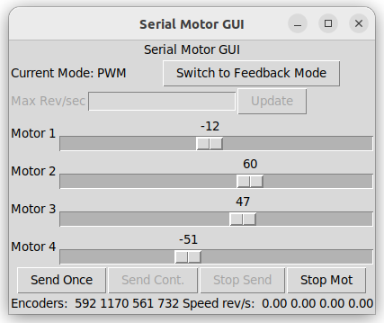
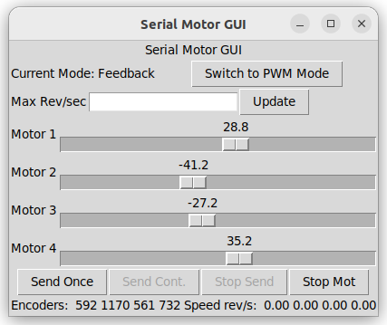

> [origin README](./README_origin.md)

## Changes
1. Captiable commands with my [arduino_pid_controlled_motor](https://github.com/wty-yy/arduino_pid_controlled_motor/)
    - `p <pwm1> <pwm2>`: pwm control
    - `s <rpm1> <rpm2>`: rpm control
2. Add a three seconds sleep before driver controlling (for stability)
3. Change colsed-loop control from `encode_revolution/(s*loop_rate)` to `rpm (wheel revolution per minute)`
4. Easy config file at [config/driver.yaml](./serial_motor_demo/config/driver.yaml)
5. Easy launch file at [launch/driver_with_gui.launch.py](./serial_motor_demo/launch/driver_with_gui.launch.py)

## Usage

```bash
cd /ros2_ws/src
git clone https://github.com/wty-yy/serial_motor_demo.git
cd serial_motor_demo
git checkout 4_wheel_drive

colcon build --symlink-install
source ./install/setup.sh
```

Update config file `./serial_motor_demo/config/driver.yaml`, then
```bash
ros2 launch serial_motor_demo driver_with_gui.launch.py
```


## GUI Usage

Has two modes, one for raw PWM input (-255 to 255) and one for closed-loop control (rpm). In this mode you must first set the limits for the sliders.

|PWM control|PID control|
|-|-|
|||
